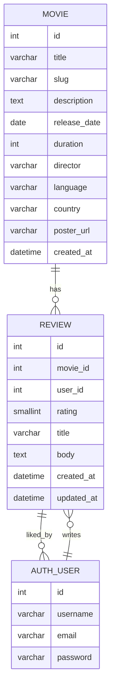

# Movie Review API

This is a RESTful API for managing movies and user reviews. Users can browse movies, add reviews with ratings, and interact with other reviews by liking them.

## Features

*   **Movie Management:**
    *   Create, retrieve, update, and delete movie entries.
    *   Movies include details like title, description, release date, director, and poster URL.
    *   Automatic slug generation for movie titles.
    *   Calculates and displays the average rating for each movie.
    *   Provides a count of reviews for each movie.
*   **Review Management:**
    *   Users can create, retrieve, update, and delete their own reviews for movies.
    *   Reviews include a rating (1-5 stars), title, and body.
    *   Users can "like" other user's reviews.
    *   Displays the number of likes a review has received.
    *   Reviews are ordered by creation date (newest first).

*   **Authentication & Permissions:**
    *   Uses Django REST Framework's default authentication system.
    *   Read-only access for unauthenticated users.
    *   Authenticated users can create, update, and delete movies and reviews (with appropriate ownership checks for reviews).
*   **Search and Filtering:**
    *   Search movies by title, director, language, and country.
    *   Order movies by release date, average rating, or title.

## Technologies Used

*   **Django:** Web framework
*   **Django REST Framework:** For building the REST API
*   **SQLite (default):** Database

## Setup and Installation

### 1. Clone the repository

```bash
git clone <repository_url>
cd <project_directory>
```

### 2. Create a virtual environment and activate it

```bash
python -m venv venv
source venv/bin/activate  # On Windows: `venv\Scripts\activate`
```

### 3. Install dependencies

```bash
pip install Django djangorestframework
```

### 4. Database Migrations

Apply the database migrations to create the necessary tables:

```bash
python manage.py makemigrations
python manage.py migrate
```

### 5. Create a Superuser (Optional, but recommended for admin access)

```bash
python manage.py createsuperuser
```

Follow the prompts to create an admin user.

### 6. Run the Development Server

```bash
python manage.py runserver
```

The API will be available at `http://127.0.0.1:8000/`.

## API Endpoints

The API follows a standard RESTful structure.

### Movies

*   **List all movies:** `GET /api/movies/`
*   **Retrieve a single movie:** `GET /api/movies/{id}/` or `GET /api/movies/{slug}/`
*   **Create a new movie:** `POST /api/movies/` (Authenticated users only)
*   **Update a movie:** `PUT /api/movies/{id}/` or `PATCH /api/movies/{id}/` (Authenticated users only)
*   **Delete a movie:** `DELETE /api/movies/{id}/` (Authenticated users only)

**Search and Filtering Examples:**

*   `GET /api/movies/?search=action`
*   `GET /api/movies/?ordering=-release_date`
*   `GET /api/movies/?search=nolan&ordering=average_rating`

### Reviews

*   **List all reviews:** `GET /api/reviews/`
*   **Retrieve a single review:** `GET /api/reviews/{id}/`
*   **Create a new review:** `POST /api/reviews/` (Authenticated users only)
    *   Requires `movie` (ID), `rating` (1-5), and optionally `title` and `body`.
*   **Update a review:** `PUT /api/reviews/{id}/` or `PATCH /api/reviews/{id}/` (Only the review owner can update)
*   **Delete a review:** `DELETE /api/reviews/{id}/` (Only the review owner can delete)
*   **Like/Unlike a review:** (This functionality is not explicitly implemented as a separate endpoint in the provided code, but typically would be done via a `POST` or `PATCH` to a specific review's 'like' endpoint, or by including `liked_by` in a PATCH request if `liked_by` was writable for the current user.)

## Data Models

### Movie
```
- title (CharField)
- slug (SlugField, unique)
- description (TextField)
- release_date (DateField)
- duration (PositiveIntegerField)
- director (CharField)
- language (CharField)
- country (CharField)
- poster_url (URLField)
- created_at (DateTimeField)
- average_rating (Property, derived from reviews)
- review_count (SerializerMethodField)
```


### Review
```
- movie (ForeignKey to Movie)
- user (ForeignKey to User)
- rating (PositiveSmallIntegerField, 1-5)
- title (CharField)
- body (TextField)
- liked_by (ManyToManyField to User)
- created_at (DateTimeField)
- updated_at (DateTimeField)
- likes_count (Property)
```

## How to use the API (Example with `curl`)

### Authenticate (Obtain a token - if using Token Authentication)

(Note: The provided code doesn't include token authentication setup. You would typically use `rest_framework.authtoken` or a similar package for this.)


### Create a Movie

First, make sure you have authenticated.

```bash
curl -X POST -H "Content-Type: application/json" \
     -H "Authorization: Token <your_token>" \
     -d '{
           "title": "Inception",
           "description": "A thief who steals information by entering people''s dreams...",
           "release_date": "2010-07-16",
           "duration": 148,
           "director": "Christopher Nolan",
           "language": "English",
           "country": "USA",
           "poster_url": "http://example.com/inception.jpg",
         }' \
     http://127.0.0.1:8000/api/movies/
```

### Get all Movies

```bash
curl http://127.0.0.1:8000/api/movies/
```

### Create a Review for a Movie

```bash
curl -X POST -H "Content-Type: application/json" \
     -H "Authorization: Token <your_token>" \
     -d '{
           "movie": 1,
           "rating": 5,
           "title": "Mind-blowing!",
           "body": "One of the best movies ever made, a true masterpiece."
         }' \
     http://127.0.0.1:8000/api/reviews/
```

## Database Schema Diagram

Here's a simplified representation of the database schema:



## Further Enhancements

*   **User Authentication:** Implement robust user authentication (e.g., JWT, Token Authentication) for more secure API access.
*   **User Profiles:** Expand user profiles to include more information.
*   **Image Uploads:** Instead of just a `poster_url`, allow direct image uploads for movie posters.
*   **Pagination:** Implement pagination for large lists of movies and reviews.
*   **Testing:** Add unit and integration tests for models, serializers, and views.
*   **Deployment:** Instructions for deploying the application to a production environment.
*   **Admin Interface:** Customize the Django admin panel for easier data management.
*   **Like/Unlike Endpoint:** Explicitly define an endpoint for liking/unliking reviews.
